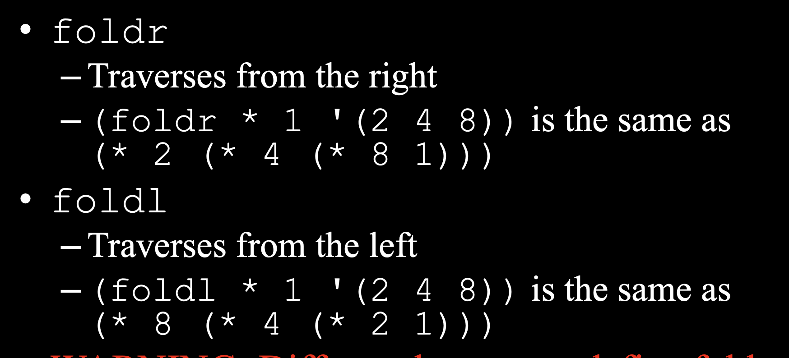
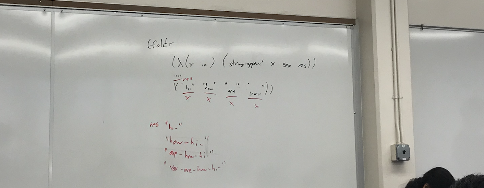

## for lab3, part3
```racket
(define (managers-only lst)
    (filter
        (λ (emp) (eq? (cadddr emp) ("Manager")))
        lst    
    )
)
```
---

## caddr means:
```ruby
(cadddr x)
=> 
    (car
        (cdr 
            (cdr 
                (cdr x)
            )
        )
    )
```

---

## Fold variants




