## Introduction to Prolog

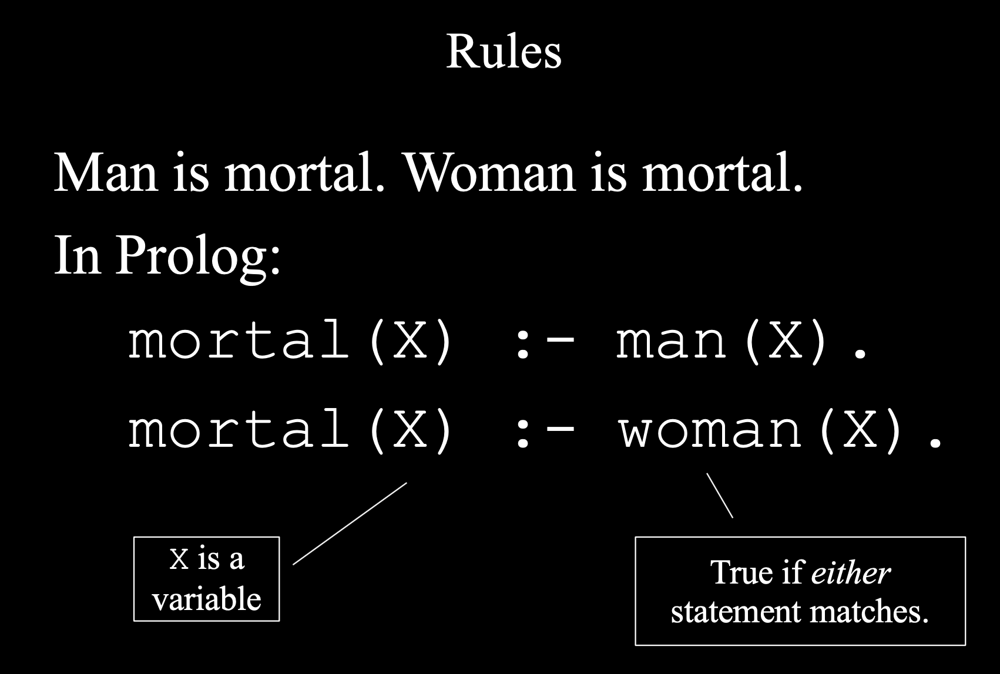

- if X is a man, then X is mortal
- if X is a woman, then X is mortal
- X is a capital letter, not a lowercase x that means this is a variable, if it starts with 
  lowercase letter, it's not variable

- comma, is `and`
---


### Using not
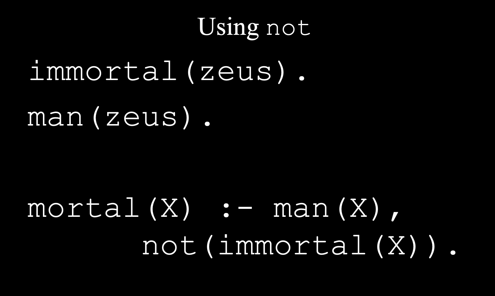
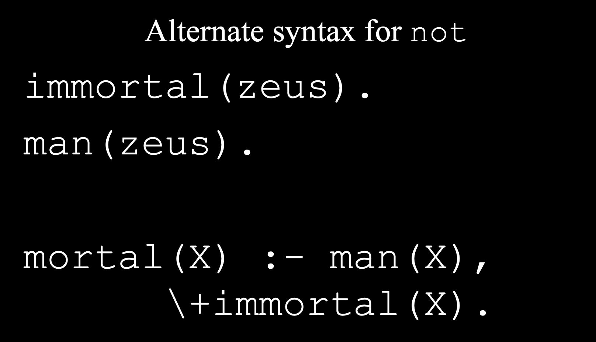


- `X \= jamie` ; != , different than not

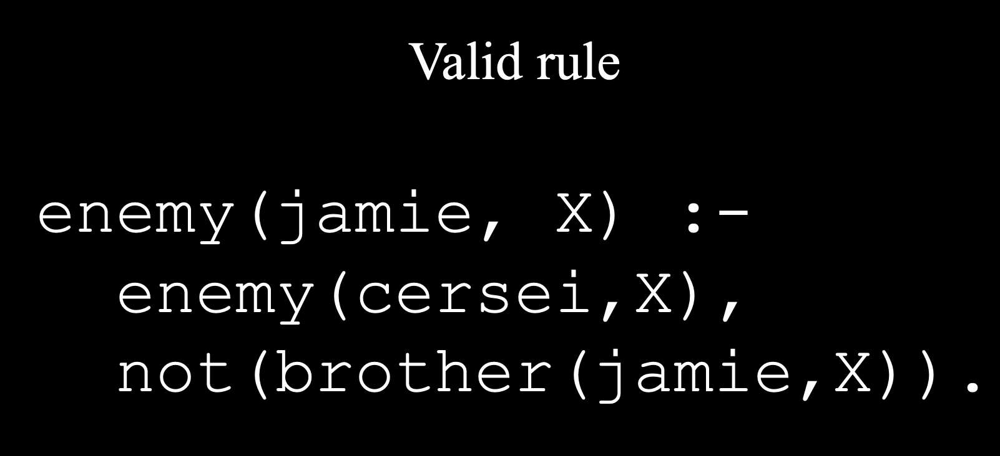

- one thing here, you can put `not(...)` first

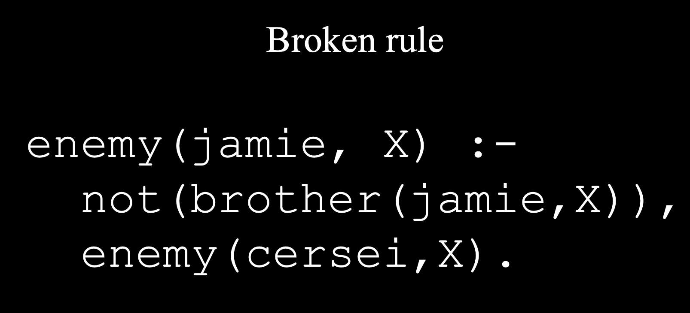
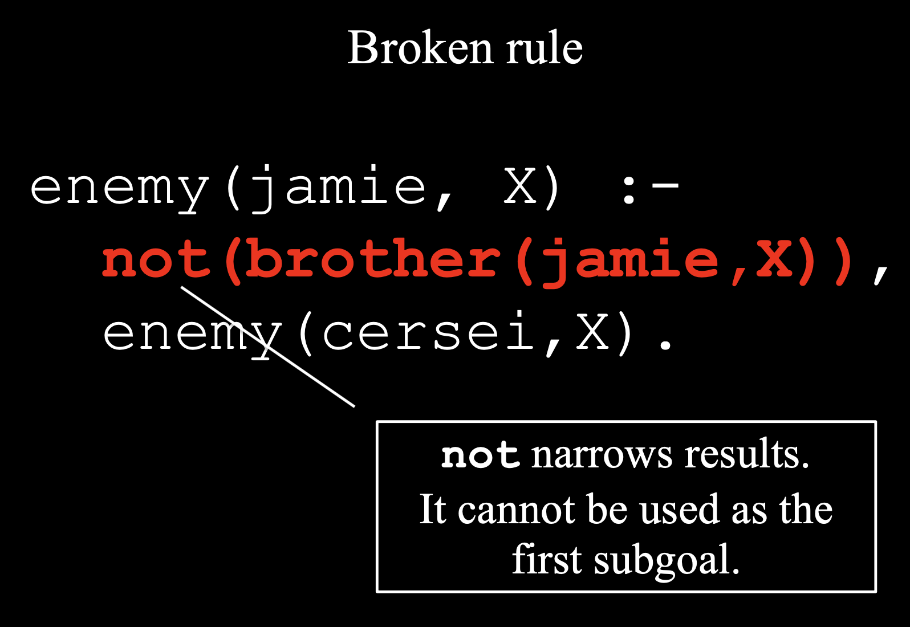
- this won't give us any results back, so this will always return false 

---

## Game of Thrones in Prolog 

- create a folder `day16/GOT.prolog`

```js
king(robert).
wife(cersei,robert).

brother(jamie,cersei). 
brother(jamie,tyrion). 
brother(tyrion,jamie).

friend(robert,ned). 
friend(robert,jon_arryn). 
friend(tyrion,bronn). 
friend(tyrion,jamie).

enemy(cersei, X) :- friend(robert,X). 
enemy(cersei, X) :- friend(tyrion,X), X \= jamie. 
enemy(jamie, X) :- enemy(cersei,X),
					not(brother(jamie,X)). 

queen(X) :- wife(X,Y), king(Y).
```

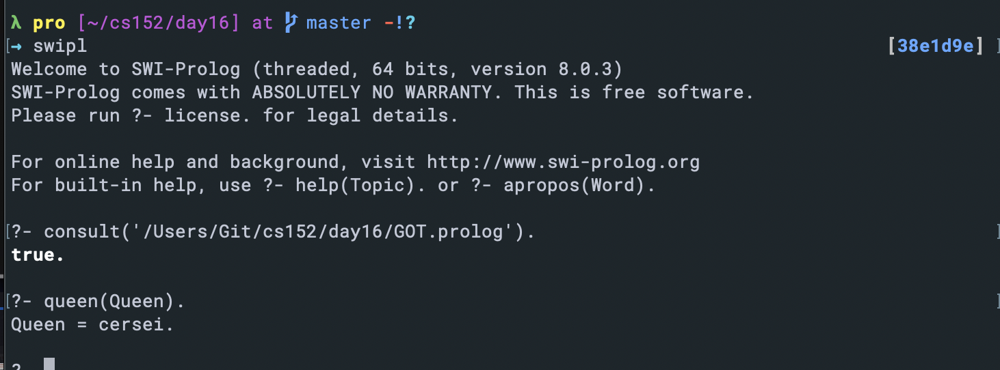

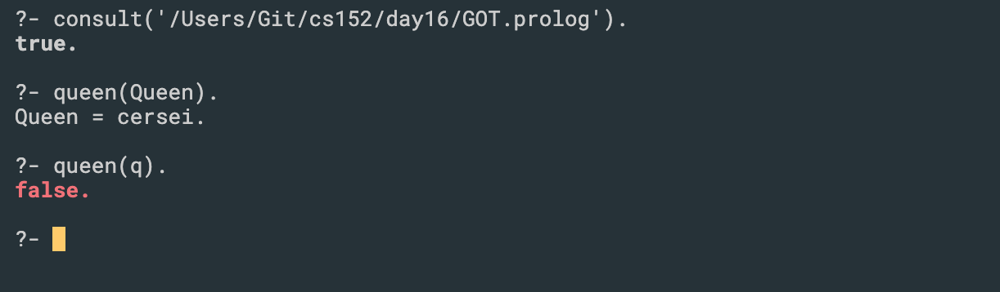

- Note, can not use lowercase letter.

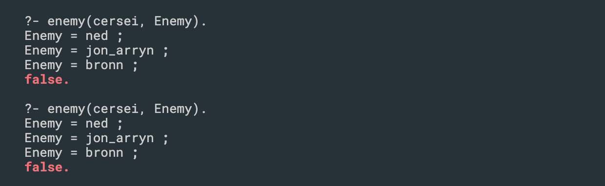

- A semicolon means that I want more results.
- A period means I'm done.

---

## 或者cd 到当前路径， run `swipl` => [got]. => true

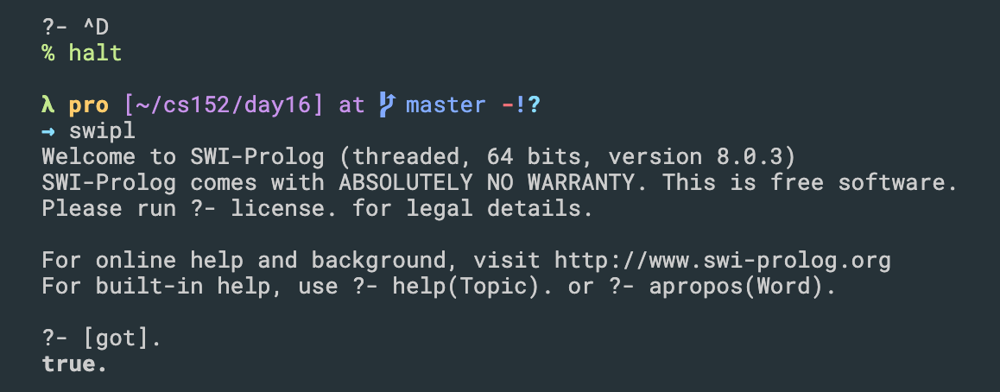

- update `GOT.prolog`

```js
king(robert).
wife(cersei,robert).

brother(jamie,cersei). 
brother(jamie,tyrion). 
brother(tyrion,jamie).

friend(robert,ned). 
friend(robert,jon_arryn). 
friend(tyrion,bronn). 
friend(tyrion,jamie).

enemy(tyrion, littlefinger).
enemy(cersei, robert).
enemy(cersei, tyrion).

%Rules
enemy(cersei, X) :- friend(robert,X). 
enemy(cersei, X) :- friend(tyrion,X), X \= jamie. 
enemy(jamie, X) :- enemy(cersei,X),
					not(brother(jamie,X)). 

queen(X) :- wife(X,Y), king(Y).
```
---

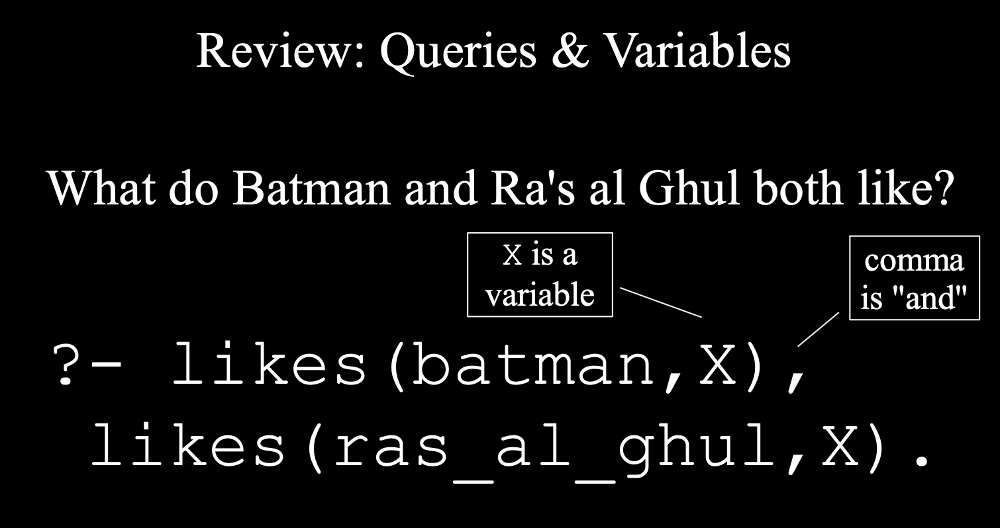

