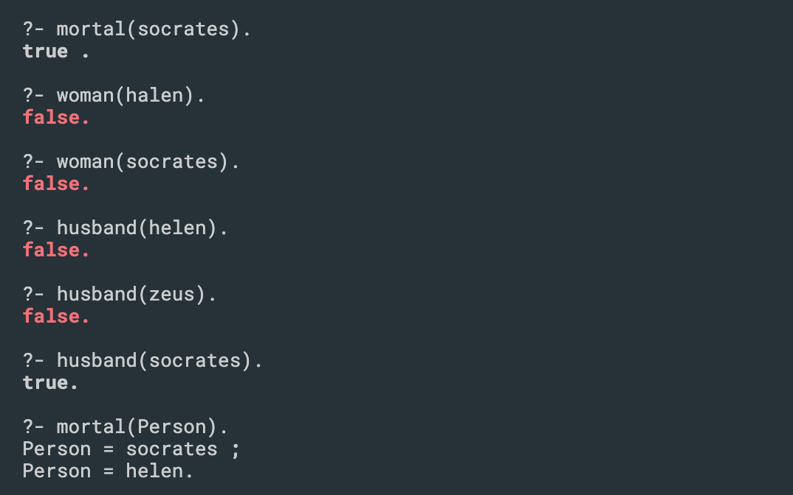

## Introduction to Prolog


- if X is a man, then X is mortal
- if X is a woman, then X is mortal
- X is a capital letter, not a lowercase x that means this is a variable, if it starts with 
  lowercase letter, it's not variable

- comma, is `and`
-  `.` here, it's equivalent to a semicolon in Java

- 主要在terminal,  ?- [文件名].   //=> return 文件里的内容
---


### Using not


- `\+immortal(X).`
- here is another syntax for not
- exactly same with `not`

---

### loading Proglo file


```ruby
%facts
man(socrates). 
man(zeus). 
woman(helen).

immortal(zeus).

%Rules
mortal(X) :- man(X), not(immortal(X)). 
mortal(X) :- woman(X).

married(socrates).
married(helen).

husband(Person) :- married(Person),
				   man(Person).
```




---
- `X \= jamie` ; != , different than not


- one thing here, you can put `not(...)` first


- this won't give us any results back, so this will always return false 

---

## Game of Thrones in Prolog 

- create a folder `day16/GOT.prolog`

```js
king(robert).
wife(cersei,robert).

brother(jamie,cersei). 
brother(jamie,tyrion). 
brother(tyrion,jamie).

friend(robert,ned). 
friend(robert,jon_arryn). 
friend(tyrion,bronn). 
friend(tyrion,jamie).

enemy(cersei, X) :- friend(robert,X). 
enemy(cersei, X) :- friend(tyrion,X), X \= jamie. 
enemy(jamie, X) :- enemy(cersei,X),
					not(brother(jamie,X)). 

queen(X) :- wife(X,Y), king(Y).
```


- Note, can not use lowercase letter.


- A semicolon means that I want more results.
- A period means I'm done.

---

## 或者cd 到当前路径， run `swipl` => [got]. => true


- update `GOT.prolog`

```js
king(robert).
wife(cersei,robert).

brother(jamie,cersei). 
brother(jamie,tyrion). 
brother(tyrion,jamie).

friend(robert,ned). 
friend(robert,jon_arryn). 
friend(tyrion,bronn). 
friend(tyrion,jamie).

enemy(tyrion, littlefinger).
enemy(cersei, robert).
enemy(cersei, tyrion).

%Rules
enemy(cersei, X) :- friend(robert,X). 
enemy(cersei, X) :- friend(tyrion,X), X \= jamie. 
enemy(jamie, X) :- enemy(cersei,X),
					not(brother(jamie,X)). 

queen(X) :- wife(X,Y), king(Y).
```


- who is queen?
- we can use first letter is capital method does this. I am looking to get an ans for this.


- remember, if hit q, it doen't work.


- agian, 第一个字母大写代表，变量
---

```ruby

villain(joker).
villain(penguin).
villain(catwoman).
villain(scarecrow).
villain(bane).

kills_people(joker).
kills_people(penguin).
kills_people(bane).

power(scarecrow, fear).
power(bane,venom).

% Rules
scary(V) :- villain(V), kills_people(V).
scary(V) :- villain(V), power(V,_).

% ?- findall(V, scary(V), R).
% R = [joker, penguin, bane, scarecrow, bane].
% 
% ?- setof(V, scary(V), R).  
% R = [bane, joker, penguin, scarecrow].

% What if we did not have setof?
find_scary(ScarySet) :-
  findall(V, scary(V), ListOfScaries),
  get_unique(ListOfScaries,ScarySet),
  !. % Green cut

get_unique([],[]).
get_unique([H|Tail], Set) :-
  get_unique(Tail, TailSet),
  \+ member(H, TailSet),
  Set = [H|TailSet].
get_unique([H|Tail], Set) :-
  get_unique(Tail, TailSet),
  member(H, TailSet),
  Set = TailSet.
```


