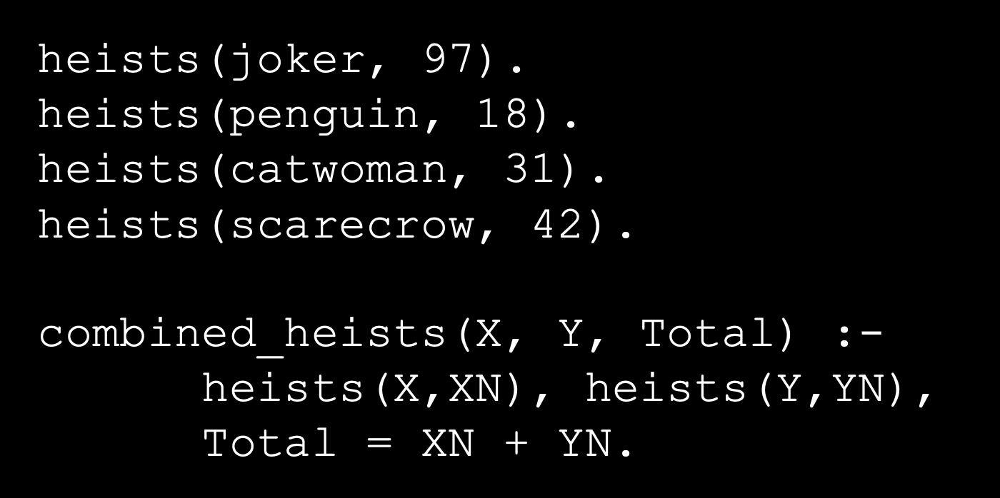
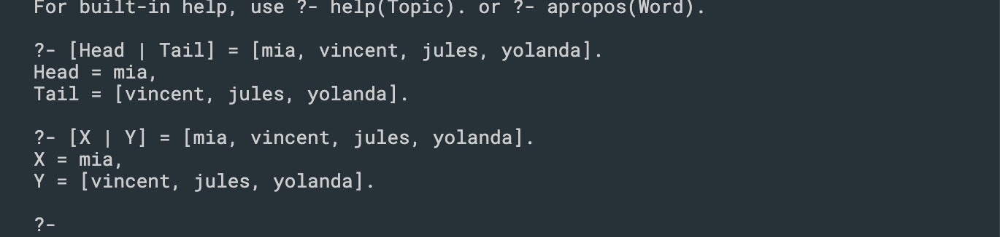

### day17 prolog


## The Cut Operator

### no cuts


- why need cuts? since if without cut, it still continue search? 


### Green cut


- after green cut, you don't need consider the second match.


- batman.prolog

```js
villain(joker).
villain(penguin).
villain(catwoman).
villain(scarecrow).
villain(bane).

kills_people(joker).
kills_people(penguin).
kills_people(bane).

power(scarecrow, fear).
power(bane,venom).

% Rules
scary(V) :- villain(V), kills_people(V).
scary(V) :- villain(V), power(V,_).

% ?- findall(V, scary(V), R).
% R = [joker, penguin, bane, scarecrow, bane].
% 
% ?- setof(V, scary(V), R).  
% R = [bane, joker, penguin, scarecrow].

% What if we did not have setof?
find_scary(ScarySet) :-
  findall(V, scary(V), ListOfScaries),
  get_unique(ListOfScaries,ScarySet),
  !. % Green cut

get_unique([],[]).
get_unique([H|Tail], Set) :-
  get_unique(Tail, TailSet),
  \+ member(H, TailSet),
  Set = [H|TailSet].
get_unique([H|Tail], Set) :-
  get_unique(Tail, TailSet),
  member(H, TailSet),
  Set = TailSet.
```

- who is going to be the first scary villain?


---


## Arithmetic in Prolog



```js
heists(joker, 97). 
heists(penguin, 18). 
heists(catwoman, 31). 
heists(scarecrow, 42).

combined_heists(X, Y, Total) :- 
		heists(X,XN), heists(Y,YN), 
		Total is XN + YN.
```


---

## The Cut Operator


---


## List in Prolog


### Prolog list solutions are often recursive.




- append method.


- myappend method:

```ruby
myappend([], L2, L2).   %base case
myappend([H|T1], L2, [H|T2]) :- myappend(T1, L2, T2). %Recursive case
```

- Prefix


---


## Reversing a List

```ruby
myreverse([], []).
myreverse([H|T], L) :- myreverse(T, RT), append(RT, [H], L).


naiverev([],[]).
naiverev([H|T],R):-  naiverev(T,RevT),  append(RevT,[H],R).
```

- using Accumulator:

```ruby
   List:  [a,b,c,d]    Accumulator:  []
   List:  [b,c,d]        Accumulator:  [a]
   List:  [c,d]            Accumulator:  [b,a]
   List:  [d]                Accumulator:  [c,b,a]
   List:  []                  Accumulator:  [d,c,b,a]

 
    accRev([H|T],A,R):-  accRev(T,[H|A],R).
    accRev([],A,A).
```

---


## Graph

