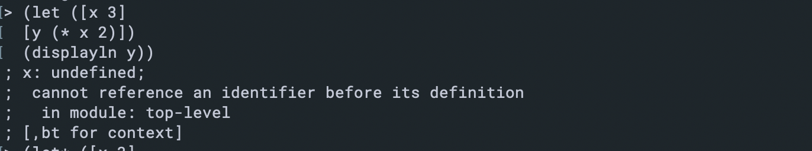
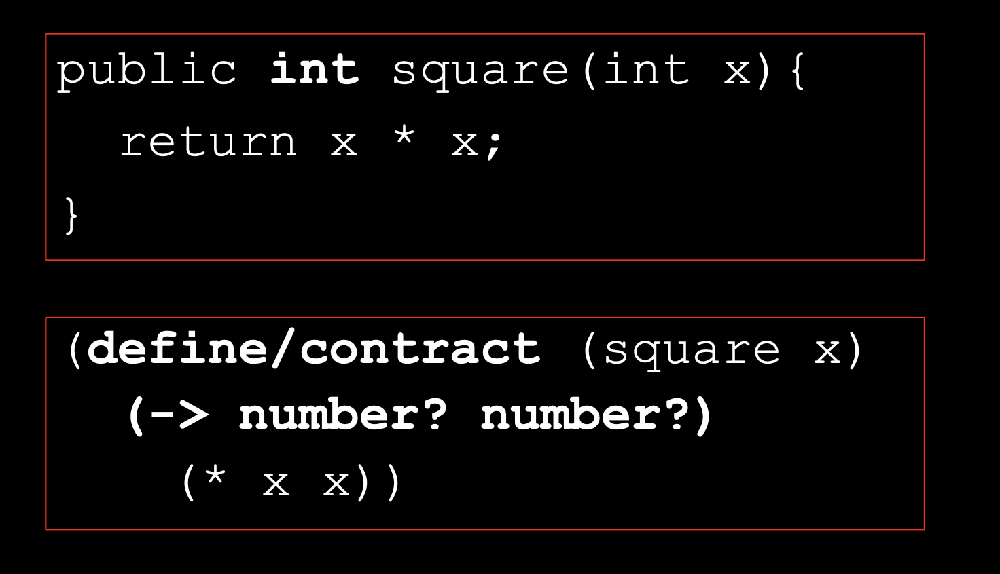
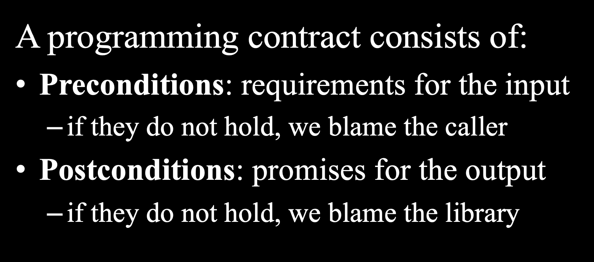
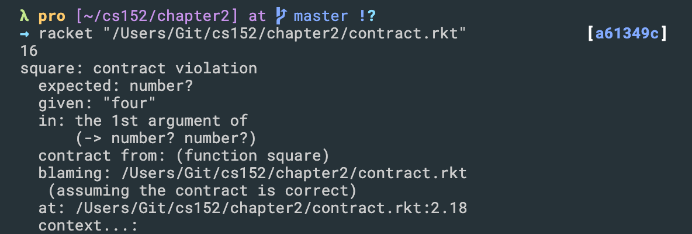

## `let and let*`
```scheme
(let ([x 3]
        [y (* x 2)])
  (displayln y))  
```

-
- Local variables can be introduced without explicitly creating a procedure. The special form `let` introduces a list of local variables for use within its body:
```scheme
(let ((x 1)
      (y 2)
      (z 3))
  (list x y z))
=>  (1 2 3)


;As with lambda, within the let-body, the local x (bound to 1) shadows the global x (which is bound to 20).

;The local variable initializations — x to 1; y to 2; z to 3 — are not considered part of the let body. Therefore, a reference to x in the initialization will refer to the global, not the local x:
(let ((x 1)
      (y x))
  (+ x y))
=>  21
;This is because x is bound to 1, and y is bound to the global x, which is 20.


;Sometimes, it is convenient to have let’s list of lexical variables be introduced in sequence, so that the initialization of a later variable occurs in the lexical scope of earlier variables. The form let* does this:
(let* ((x 1)
       (y x))
  (+ x y))
=>  2

;The x in y’s initialization refers to the x just above. The example is entirely equivalent to — and is in fact intended to be a convenient abbreviation for — the following program with nested lets:
(let ((x 1))
  (let ((y x))
    (+ x y)))
=>  2


```


- use let*
```scheme
(let* ([x 3]                                                                               
        [y (* x 2)])                                                                              
        (displayln y))

=> 6
```
---


## Note:
- All the data types discussed so far are called s-expressions (s for symbolic)
- Note the programs themselves are also s-expressions. `Programs are data`
```scheme
All the data types discussed here can be lumped together into a single all-encompassing data type called the s-expression (s for symbolic). Thus 42, #\c, (1 . 2), #(a b c), "Hello", (quote xyz), (string‑>number "16"), and (begin (display "Hello, World!") (newline)) are all s-expressions.
```
---

## Lambdas λ
```scheme
(define my-add (λ (x y) (+ x y)))

(my-add 3 4)

=> 7

;Lambdas λ
((λ
   (x)
   (* x x) )
   3)

=> 9


;
(define square
    (λ 
    (x) 
    (* x x))
    )
(square 4)    

=> 16


;Alternate Format
(define (square x)
    (* x x)
)
(square 5)

=> 25


```
---


## Scheme method with contracts


#### Programming contracts
- Similar to types, but:
    - A runtime enforcement mechanism
    - Can enforce more sophisticated
        restrictions

```scheme
#lang racket
(define/contract (square x)
(-> number? number?)
(* x x))

(square 4)
(square "four")
```

---


## If Statements
- Like all languages, Scheme provides conditionals. The basic form is the if:
```scheme
(if test-expression
    then-branch
    else-branch)
```

```scheme
(define p 80)

(if (> p 70) 
    'safe
    'unsafe)
=>  safe 

(if (< p 90)
    'low-pressure) ;no ``else'' branch
=>  low-pressure 
```

- cond
- The cond form is convenient for expressing nested if-expressions, where each “else” branch but the last introduces a new if. Thus, the form
```scheme
(cond ((char<? c #\c) -1)
      ((char=? c #\c) 0)
      (else 1))
```
---


## Recursion
- Base case
    - when to stop
- Recursive step
    - calls function with a smaller version of the same problem
```scheme
(define factorial
  (lambda (n)
    (if (= n 0) 1
        (* n (factorial (- n 1))))))
```


```scheme
(define is-even?
  (lambda (n)
    (if (= n 0) #t
        (is-odd? (- n 1)))))

(define is-odd?
  (lambda (n)
    (if (= n 0) #f
        (is-even? (- n 1)))))

 (is-even? 45)
 => #f
 
 (is-odd? 45)
=> #t
```
---
- letrec
```scheme
(letrec ((local-even? (lambda (n)
                        (if (= n 0) #t
                            (local-odd? (- n 1)))))
         (local-odd? (lambda (n)
                       (if (= n 0) #f
                           (local-even? (- n 1))))))
  (list (local-even? 23) (local-odd? 23)))

```
- The lexical variables introduced by a `letrec` are visible not only in the `letrec-body` but also within all the initializations. `letrec` is thus tailor-made for defining recursive and mutually recursive local procedures.


