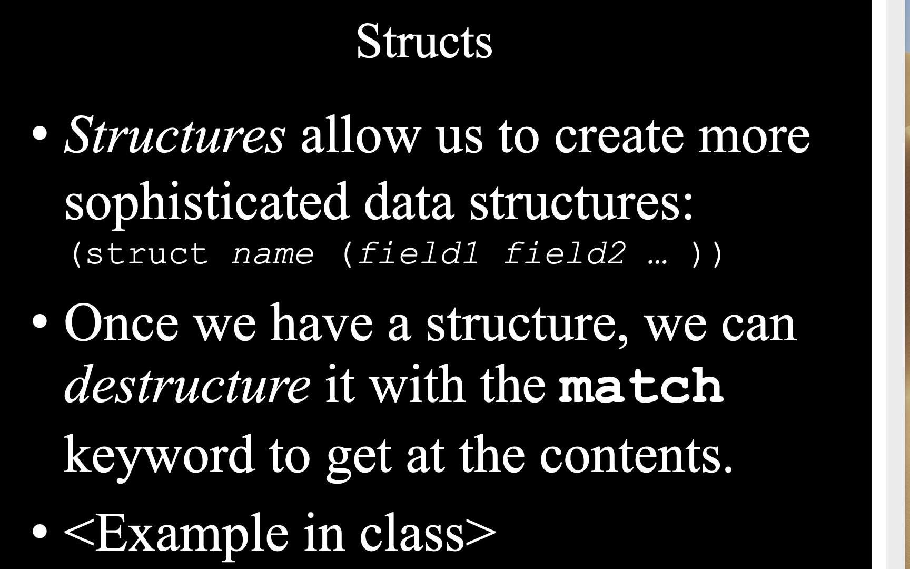
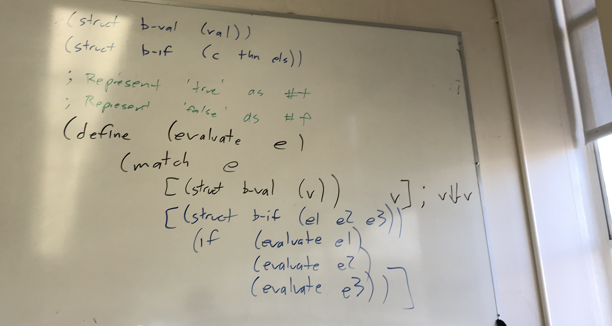
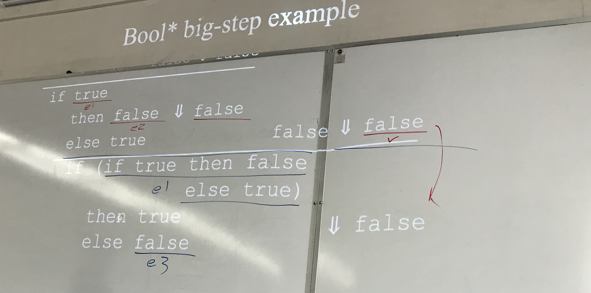
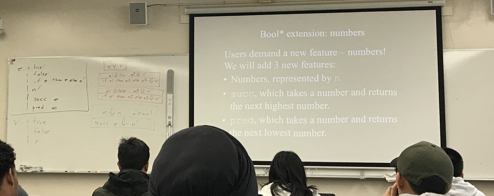
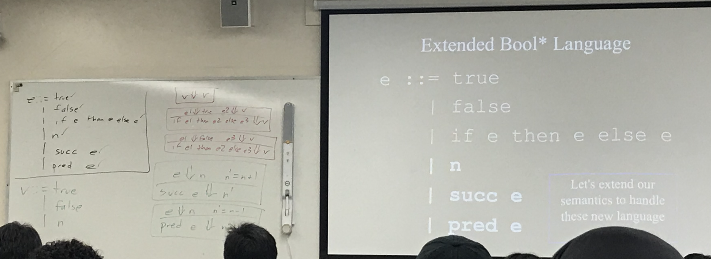
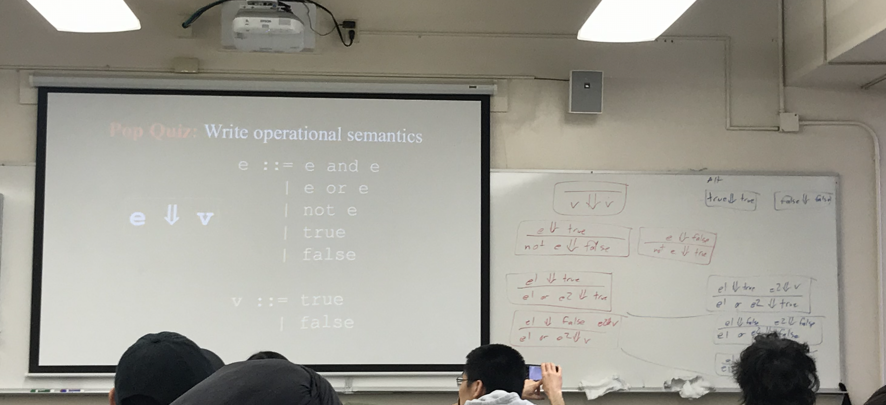
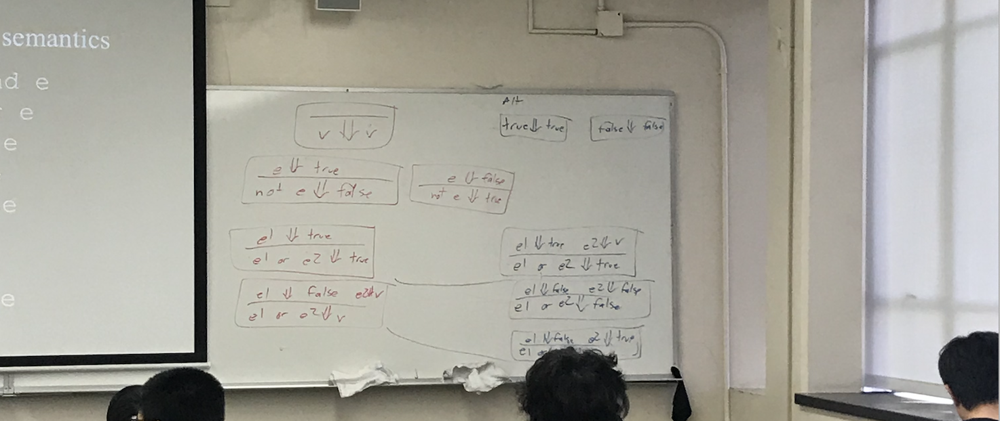

## Structs




```scheme
#lang racket
(struct employee (fname lname salary))
(struct manger (fname lname salary bonus))

(define (calc-wages emp)
    (match emp
        [(struct employee (first last sal)) ;new variables
            sal]
        [(strcut manager ( _ _ sal extra))
            (+ sal extra)]
    [ _ _ (error "Not on employee")]
    )
)


{let ([dilbert (employee "Dilbert" "Adams" 80000)]
      [aice (employee "Alice" "Rage" 95000)]
      [phb (manager "PoirtyHaired" "Boss" 105000 200000)])
    (displayln (calc-wages dilbert))
    (displayln (calc-wages alice))
    (displayln (calc-wages phb))
}
```

---

## Bool* big-step example


---


## Extended Bool* Language




