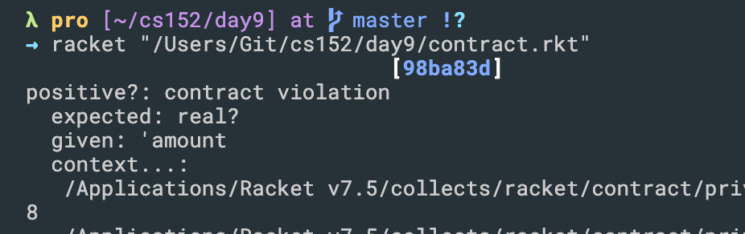

## Contract Violations

- `contract-out` specifies the requirements.
```scheme
#lang racket
 
(provide (contract-out [amount positive?]))
 
(define amount 'amount)
```

---

- To make the contract capture our intentions for all Racket values, 
we can ensure that the value is both a number and is positive, combining the two contracts with `and/c`
```scheme
#lang racket

(provide (contract-out  [amount (and/c number? positive?)])
)

(define amount 2)
```
---

## Simple Contracts on Functions
- Recall:
  - A mathematical function has a domain and a range. 
    The domain indicates the kind of values that the function can accept as arguments, 
    and the range indicates the kind of values that it produces
    `f : A -> B`,  where A is the domain of the function and B is the range.

- Functions in a programming language have domains and ranges, too, 
  and a contract can ensure that a function receives only values in its domain 
  and produces only values in its range.
  `A ->` creates such a contract for a function. 
  The forms after `a ->` specify contracts for the domains and finally a contract for the range.

```scheme
#lang racket
 
(provide (contract-out
          [deposit (-> number? any)]
          [balance (-> number?)]))
 
(define amount 0)
(define (deposit a) (set! amount (+ amount a)))
(define (balance) amount)

(deposit 5)
(displayln amount)
```
- The module exports two functions:
  1. `deposit`, which accepts a number and returns some value that is not specified in the contract, and
  2. `balance`, which returns a number indicating the current balance of the account.

- `A ->` by itself is not a contract; 
  it is a contract combinator, which combines other contracts to form a contract.
---


## Styles of ->
- If you are used to mathematical functions, 
  you may prefer a contract arrow to appear between the domain and the range of a function, 
  not at the beginning. If you have read How to Design Programs, you have seen this many times. 
  Indeed, you may have seen contracts such as these in other people’s code:
```scheme
(provide (contract-out
          [deposit (number? . -> . any)]))
```
- Thus,
`(number? . -> . any)`
is just another way of writing
`(-> number? any)`
---


## `Using define/contract and ->`
- The `define/contract` form introduced in Experimenting with Nested Contract Boundaries 
  can also be used to define functions that come with a contract. For example,
```scheme
(define/contract (deposit amount)
  (-> number? any)
  ; implementation goes here
  ....)
```
- which defines the deposit function with the contract from earlier. 
  Note that this has two potentially important impacts on the use of deposit:
1. The contract will be checked on any call to deposit that is outside of the definition of deposit – even those inside the 
   module in which it is defined. 
   Because there may be many calls inside the module, this checking may cause the contract to be checked too often, 
   which could lead to a performance degradation. This is especially true if the function is called repeatedly from a loop.

2. In some situations, a function may be written to accept a more lax set of inputs when 
   called by other code in the same module. 
   For such use cases, the contract boundary established by define/contract is too strict.
```scheme
```


```scheme
```


```scheme
```


```scheme
```


```scheme
```


